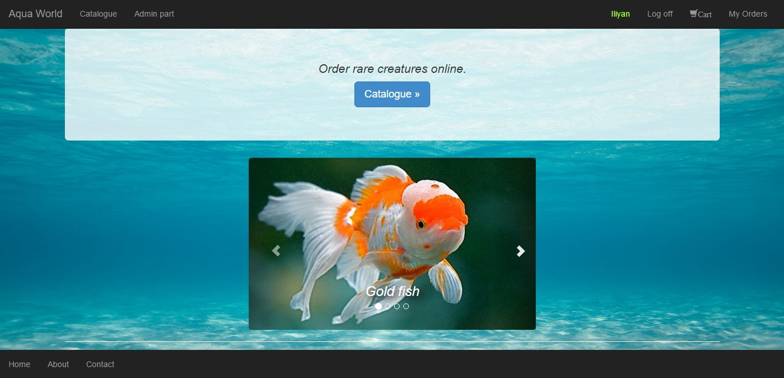

## AppVeyor & Coveralls badges

# Aqua World
  - Online catalog for water creatures. Fast and easy way to get known of their basic specifications and order them thru shopping cart.
-----------------------------------------------------------------------------------------------------------------------

## ASP.NET MVC course project
  - Ioc container - Ninject 
  - Testing - NUnit, Moq, TestStack.FluentMVCTesting
  - Validation - Bytes2you.Validation
  - ORM - EntityFramework
  - Data base - SQL Server
  - Styles - Bootstrap 
  - Continuous Integration - AppVeyor & Jenkins
  - Continuous Deployment - Jenkins
  - Code Coverage - Coveralls
  - Hosting - Azure
-----------------------------------------------------------------------------------------------------------------------

## Links

[Azure host link](http://aquaworld.azurewebsites.net) | 
[YouTube link](https://youtu.be/z_mY2kFEL0s)
-----------------------------------------------------------------------------------------------------------------------

## Author

|Name           | http://telerikacademy.com profile                        |https://github.com profile                |
|:-------------:|:--------------------------------------------------------:|:----------------------------------------:|
|Ilian Gogov    |[Iliangogov](https://telerikacademy.com/Users/Iliangogov) |[iliangogov](https://github.com/iliangogov)|

-----------------------------------------------------------------------------------------------------------------------

-----------------------------------------------------------------------------------------------------------------------

## Functionalities
 - regular users can check up catalogue of water creatures with details, add them to a shopping cart and make order.
 - admin can proceed all orders, add and edit creatures.
